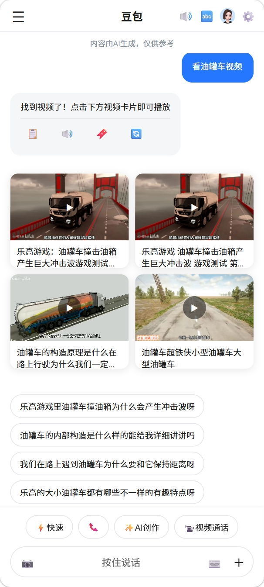
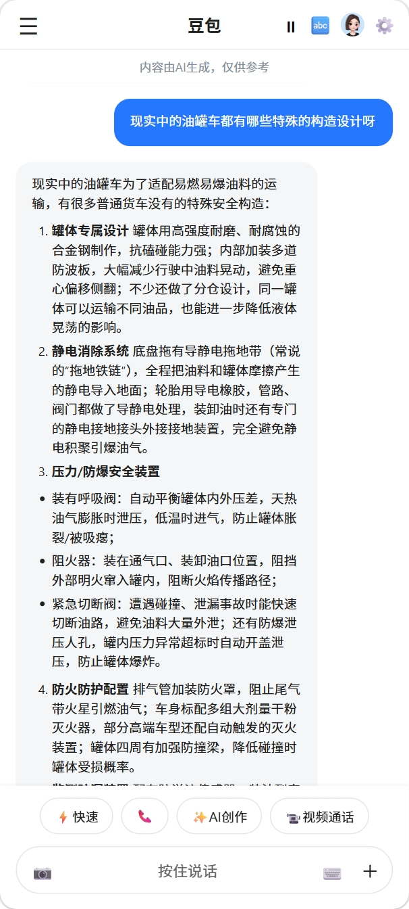
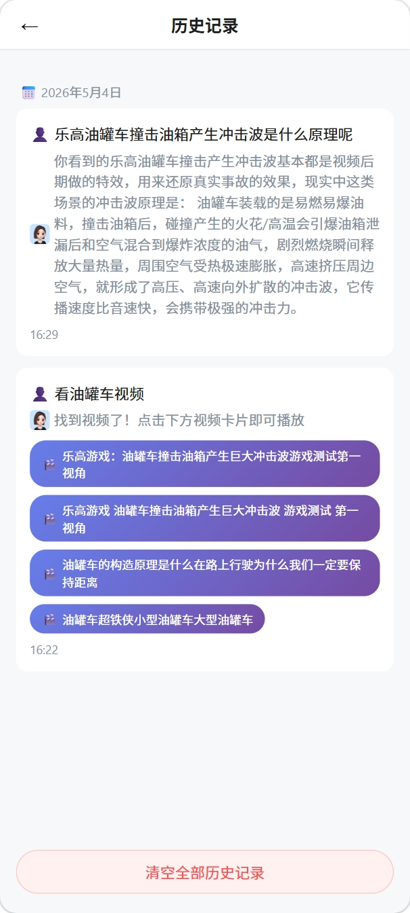
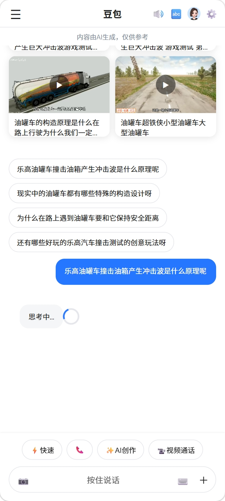
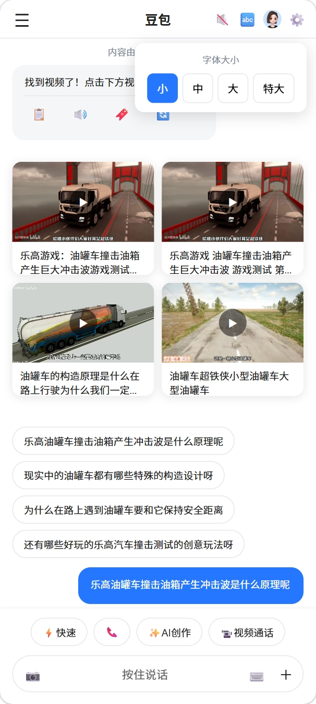
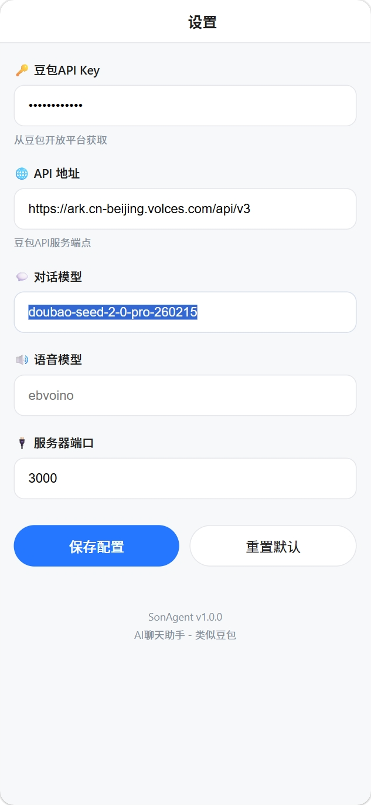

# SonAgent - 奶爸专属AI语音助手 🎤🎬

> 豆包收费了？那就自己用 **VibeCoding** 搓一个！
>
> 专为奶爸带娃场景打造：**语音聊天 + 看视频**，让娃对着手机说话就能搜动画片、听故事。

| | |
|------|------|
| **版本** | v1.6 |
| **理念** | 人人能 VibeCoding，AI 编码平民化 |
| **实现** | VSCode + CodeBuddy（免费额度）+ 白嫖豆包大模型 |
| **技术栈** | Node.js + Express + SQLite + 豆包大模型 |

---

## 📸 功能展示

<table>
  <tr>
    <td width="25%" align="center"><br><b>🏠 欢迎首页</b></td>
    <td width="25%" align="center"><br><b>🎬 视频推荐</b></td>
    <td width="25%" align="center"><br><b>📝 Markdown</b></td>
    <td width="25%" align="center"><br><b>🎤 语音输入</b></td>
  </tr>
  <tr>
    <td width="25%" align="center"><br><b>📜 历史记录</b></td>
    <td width="25%" align="center"><br><b>🤔 AI思考中</b></td>
    <td width="25%" align="center"><br><b>🔤 字体设置</b></td>
    <td width="25%" align="center"><br><b>⚙️ 设置页面</b></td>
  </tr>
  <tr>
    <td width="25%" align="center"><br><b>🎬 视频卡片列表</b></td>
    <td width="25%" align="center"><br><b>▶️ 视频播放器</b></td>
    <td colspan="2" align="center" style="background:#f8f9fa; padding:20px;">
      <b>🎯 核心流程</b><br><br>
      语音说"查看油罐车视频"<br>
      ↓<br>
      AI 识别 → 搜索本地视频<br>
      ↓<br>
      展示视频卡片列表<br>
      ↓<br>
      点击卡片 → 播放视频
    </td>
  </tr>
</table>

---

## ✨ 功能特性

| 功能 | 说明 |
|------|------|
| 🎤 **语音输入** | 按住说话，自动识别并发送，支持夸克/QQ浏览器点击模式 |
| 💬 **AI对话** | 接入豆包大模型，支持多轮上下文对话 |
| 📝 **Markdown渲染** | AI回复支持粗体、代码、链接、列表等Markdown格式 |
| 🔊 **语音播报** | AI回复自动转语音播放（Web Speech API） |
| 🎬 **视频播放** | 说"播放XX视频"展示卡片，点击播放，支持手势控制 |
| ❤️ **收藏功能** | 收藏喜欢的视频或AI回复 |
| 📜 **历史记录** | 查看历史对话，视频卡片可点击播放 |
| 💡 **智能推荐** | 根据本地视频数据，AI推荐聊天话题 |
| 📱 **手机适配** | 全屏模式，竖屏横屏自适应，支持手势控制 |

---

## 🚀 快速开始

### 1. 安装依赖

```bash
cd E:\sonagent
npm install
```

> 如需缩略图功能，还需安装 Python 依赖：`pip install opencv-python`

### 2. 配置 API Key

本项目依赖豆包大模型，需要申请免费 API Key：

> **申请地址**：https://console.volcengine.com/ark/region:ark+cn-beijing/apiKey

拿到 Key 后有两种配置方式：

**方式一：编辑配置文件（推荐）**
```bash
复制 config.json.example 为 config.json，填入：
```
```json
{
  "doubaoApiKey": "你的API Key",
  "doubaoApiUrl": "https://ark.cn-beijing.volces.com/api/v3",
  "chatModel": "doubao-seed-2-0-pro-260215",
  "serverPort": 3000
}
```

**方式二：在设置页面填写**
```
启动后访问 http://localhost:3000 → 右上角 ⚙️ 设置页 → 填写 API Key 和模型名
```

> 本版使用模型：`doubao-seed-2-0-pro-260215`，接口地址：`https://ark.cn-beijing.volces.com/api/v3`

### 3. 启动服务

```bash
npm start
```

或双击 `restart.bat` 一键启动。

### 4. 手机访问

启动后控制台会显示访问地址，手机和电脑需连接同一 Wi-Fi：

```
📱 手机访问: http://192.168.x.x:3000
💻 本机访问: http://localhost:3000
```

---

## 🎯 核心玩法：语音搜视频 → 播放

```
┌─────────────────────────────────────────────────────────────────────┐
│                                                                     │
│  🎤 你对AI说："查看油罐车视频"                                       │
│                                                                     │
│  ┌─────────────────────────────────────────────────────────────────┐ │
│  │  📷  │  查看油罐车视频                     │ 🔊 │ ＋ │ ➤     │ │
│  └─────────────────────────────────────────────────────────────────┘ │
│                              ↓                                      │
│              ┌──────────────────────────────┐                       │
│              │  AI 正在搜索本地视频...       │                       │
│              └──────────────────────────────┘                       │
│                              ↓                                      │
│  ┌─────────────────────────────────────────────────────────────────┐ │
│  │  ✅ 找到以下油罐车相关视频：                                    │ │
│  │                                                                  │ │
│  │  ┌─────────────┐  ┌─────────────┐                              │ │
│  │  │  🎬         │  │  🎬         │                              │ │
│  │  │  [缩略图]    │  │  [缩略图]    │                              │ │
│  │  │             │  │             │                              │ │
│  │  │  油罐车     │  │  油罐车     │                              │ │
│  │  │  构造原理   │  │  撞击测试   │                              │ │
│  │  └─────────────┘  └─────────────┘                              │ │
│  └─────────────────────────────────────────────────────────────────┘ │
│                              ↓                                      │
│  👆 你点击"油罐车撞击测试"卡片                                      │
│                              ↓                                      │
│  ┌─────────────────────────────────────────────────────────────────┐ │
│  │  ← 油罐车撞击测试                          ❤️                  │ │
│  ├─────────────────────────────────────────────────────────────────┤ │
│  │                          ▶                                      │ │
│  │                      [ 视频播放中 ]                             │ │
│  ├─────────────────────────────────────────────────────────────────┤ │
│  │  00:00 ━━━━━━━━●━━━━━━ 03:45    ◀◀  ▶/⏸  ▶▶    🔄           │ │
│  └─────────────────────────────────────────────────────────────────┘ │
│                                                                     │
└─────────────────────────────────────────────────────────────────────┘
```

---

## 📖 使用指南

### 🎤 语音输入
```
点击"按住说话" → 🗣️ 说话 → ✋ 松手 → 📝 自动转文字发送
```
- 最长录音30秒自动结束
- 支持夸克/QQ浏览器点击模式

### 💬 AI对话
```
输入文字/语音 → AI回复（支持Markdown渲染）
                
  ┌─────────────────────────────────┐
  │ **粗体** → 粗体                    │
  │ `代码`   → 代码                    │
  │ ``` ... ``` → 代码块              │
  │ [链接](url) → 可点击链接           │
  │ - 列表  →  ✓ 列表                 │
  └─────────────────────────────────┘
```

### 🎬 视频播放与控制
```
对AI说"播放XX视频" → 展示视频卡片 → 点击卡片播放

操作方式：
  👆 点击屏幕       → 播放/暂停
  👈 👉 左右滑动    → 快进/快退
  🔄 点击旋转按钮  → 切换横竖屏
  ❤️ 点击收藏按钮  → 收藏视频
```

### 📜 历史记录
```
点击左上角📜 → 按日期分组展示 → 点击视频卡片直接播放
```
- 自动保存每次对话
- 支持清空全部历史

---

## 📂 目录结构

```
E:\sonagent\
├── server.js              # Node.js 服务端
├── config.json            # 配置文件（已加入 .gitignore）
├── config.json.example    # 配置模板
├── videos.json            # 视频元数据
├── favorites.json         # 收藏数据
├── generate_thumbnails.py # 缩略图生成脚本（Python + OpenCV）
├── package.json           # 依赖配置
├── LICENSE                # MIT 开源许可证
├── data/                  # 数据存储
│   └── history.db         # SQLite 历史记录数据库
├── doc/                   # 功能截图
├── public/                # 前端文件
│   ├── index.html         # 聊天主页
│   ├── player.html        # 视频播放页
│   ├── settings.html      # 设置页
│   ├── favorites.html     # 收藏页
│   ├── history.html       # 历史记录页
│   └── js/                # 前端逻辑
└── start.ps1 / restart.bat # 启动脚本
```

## 🌐 API 接口

| 接口 | 方法 | 说明 |
|------|------|------|
| `/api/chat` | POST | AI对话 |
| `/api/tts` | POST | 语音合成 |
| `/api/prompt-suggestions` | GET | 提示词推荐 |
| `/api/videos` | GET | 搜索本地视频 |
| `/api/video-path/:id` | GET | 获取视频路径 |
| `/api/favorites` | GET/POST/DELETE | 收藏管理 |
| `/api/history` | GET/POST/DELETE | 历史记录 |
| `/api/config` | GET/POST | 配置管理 |

---

## ⚠️ 注意事项

### API 依赖
- **豆包大模型**：必须申请 API Key 才能使用，[免费申请](https://console.volcengine.com/ark/region:ark+cn-beijing/apiKey)
- 接口地址：`https://ark.cn-beijing.volces.com/api/v3`
- 当前模型：`doubao-seed-2-0-pro-260215`

### 浏览器兼容
- 🟢 **夸克浏览器** — 完整体验（语音输入 + 键盘输入）
- 🟡 **其他浏览器** — 仅键盘输入，长按语音识别可能不支持
- 语音识别使用浏览器自带的 Web Speech API，各浏览器兼容性不同

### 其他
1. **端口占用** - 如果3000端口被占用，修改配置文件中的 `serverPort`
2. **局域网** - 手机和电脑需在同一网络

---

## 🛠️ 开发相关

本项目使用 **VSCode + CodeBuddy 插件** 开发。

| 工具 | 链接 |
|------|------|
| VSCode | https://code.visualstudio.com/ |
| CodeBuddy 插件 | https://www.codebuddy.cn/profile/usage |

> CodeBuddy 提供免费 AI 编程额度，无需付费即可完成本项目开发。

---

## 🎬 如何添加视频

> 把视频文件放入 `public/videos/` 目录即可，启动时自动识别并更新数据源。

### 操作步骤

```
1. 将视频文件复制到 public/videos/ 目录
   └── public/videos/
       ├── oil_tanker_test.mp4
       └── 你的视频文件.mp4

2. 重启服务（或修改文件后自动生效）
   npm start
   或双击 restart.bat

3. 对AI说"播放你的视频" → 自动识别并展示
```

> **只需拷贝文件，无需手动编辑任何配置！**

### 命名规范

| 要求 | 说明 |
|------|------|
| 文件名 | 建议字母、数字、下划线，如 `oil_tanker_test.mp4` |
| 避免 | 全角符号 `：！？，·`、空格、emoji |
| 推荐 | `简短_描述.mp4` 格式 |

> 文件名中的关键词会被AI用于搜索，建议命名有描述性，如 `变形金刚_预告片.mp4`。

### 支持的视频格式

`mp4` `avi` `mkv` `mov` `wmv` `flv` `webm`

---

## 📄 文档体系

> **版本管理**: 当前项目版本 v1.6 | 沟通轮次 第10次

| 文档 | 用途 | 说明 |
|------|------|------|
| [PRD.md](PRD.md) | 需求文档 | 各版本功能需求与技术方案 |
| [开发记录.md](开发记录.md) | 开发任务清单 | 迭代记录与排查过程 |
| [变更日志.md](变更日志.md) | 版本变更记录 | 版本历史与新功能列表 |
| [沟通记录.md](沟通记录.md) | 沟通纪要 | 用户讨论与技术方案确认 |
| [ISSUES.md](ISSUES.md) | 技术问题积累 | Bug排查过程与经验总结 |

---

## 📜 开源许可

本项目基于 [MIT License](LICENSE) 开源。
